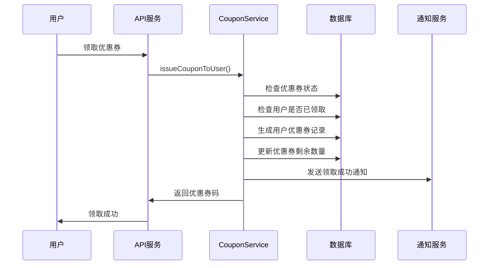
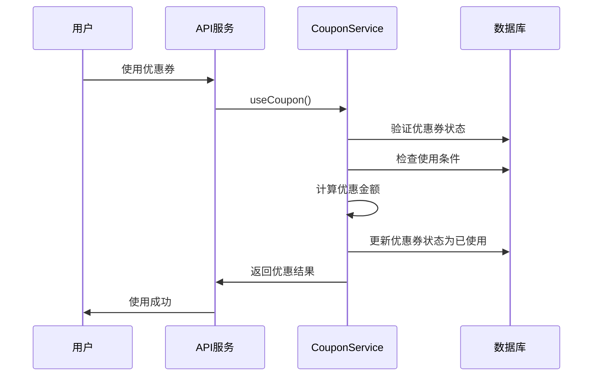

# Task 22: 优惠券管理系统实现文档

## 概述

本文档描述了智能充电应用优惠券管理系统的完整实现，包括优惠券创建、发放、使用、过期管理和统计分析功能。

## 功能特性

### 1. 优惠券类型支持

- ✅ **立减券** (discount) - 固定金额减免
- ✅ **折扣券** (percentage) - 按百分比折扣
- ✅ **返现券** (cashback) - 充电后返现
- ✅ **免费券** (free_charging) - 免费充电

### 2. 优惠券管理

- ✅ 优惠券创建和配置
- ✅ 发放数量控制
- ✅ 使用条件设置（最小金额、最大优惠等）
- ✅ 适用场景配置（充电、充值、会员等）
- ✅ 有效期管理

### 3. 用户功能

- ✅ 优惠券领取
- ✅ 我的优惠券管理
- ✅ 订单使用优惠券
- ✅ 优惠券状态跟踪

### 4. 自动化功能

- ✅ 过期优惠券自动清理
- ✅ 过期提醒通知
- ✅ 使用统计分析

## 技术架构

### 数据模型

#### 1. 优惠券模型 (`Coupon`)

```typescript
interface ICoupon {
  couponId: string; // 优惠券ID
  name: string; // 优惠券名称
  description: string; // 描述
  type: CouponType; // 类型
  value: number; // 面值
  minAmount?: number; // 最小使用金额
  maxDiscount?: number; // 最大优惠金额
  validFrom: Date; // 生效时间
  validTo: Date; // 过期时间
  totalQuantity: number; // 总发行量
  usedQuantity: number; // 已使用数量
  remainingQuantity: number; // 剩余数量
  isActive: boolean; // 是否启用
  applicableScenarios: string[]; // 适用场景
  targetUsers?: string[]; // 目标用户
}
```

#### 2. 用户优惠券模型 (`UserCoupon`)

```typescript
interface IUserCoupon {
  userId: string; // 用户ID
  couponId: string; // 优惠券ID
  couponCode: string; // 优惠券码
  status: CouponStatus; // 状态
  receivedAt: Date; // 领取时间
  usedAt?: Date; // 使用时间
  usedOrderId?: string; // 使用订单ID
  expiredAt: Date; // 过期时间
}
```

### 服务层架构

#### 1. CouponService - 核心业务逻辑

```typescript
class CouponService {
  // 优惠券管理
  createCoupon(data: CreateCouponData): Promise<ICoupon>;
  getCoupons(query: CouponQuery): Promise<CouponListResult>;

  // 用户操作
  issueCouponToUser(couponId: string, userId: string): Promise<IUserCoupon>;
  getUserCoupons(query: UserCouponQuery): Promise<UserCouponListResult>;
  useCoupon(data: CouponUsageData): Promise<CouponUsageResult>;

  // 订单集成
  getAvailableCouponsForOrder(
    userId: string,
    amount: number,
    scenario: string
  ): Promise<any[]>;

  // 统计分析
  getCouponStats(timeRange: string): Promise<CouponStats>;

  // 维护功能
  cleanupExpiredCoupons(): Promise<CleanupResult>;
  batchIssueCoupons(couponId: string, userIds: string[]): Promise<BatchResult>;
}
```

#### 2. CouponNotificationService - 通知服务

```typescript
class CouponNotificationService {
  // 过期提醒
  checkExpiringCoupons(): Promise<CouponNotification[]>;

  // 通知发送
  sendNewCouponNotification(
    userId: string,
    couponCode: string,
    couponName: string
  ): Promise<void>;
  sendUsageReminderNotification(userId: string): Promise<void>;

  // 通知管理
  getUserCouponNotifications(userId: string, limit: number): Promise<any[]>;
  markNotificationAsRead(userId: string, notificationId: string): Promise<void>;
}
```

#### 3. CouponCleanupService - 清理服务

```typescript
class CouponCleanupService {
  // 定时任务
  startCleanupSchedule(): void;
  stopCleanupSchedule(): void;

  // 手动清理
  manualCleanup(): Promise<CleanupResult>;
}
```

### API 接口设计

#### 用户接口

```
GET    /api/coupon/my-coupons              # 获取我的优惠券
POST   /api/coupon/claim/:couponId         # 领取优惠券
GET    /api/coupon/available-for-order     # 获取订单可用优惠券
POST   /api/coupon/use                     # 使用优惠券
GET    /api/coupon/stats                   # 获取统计信息
```

#### 管理员接口

```
POST   /api/coupon/admin/create            # 创建优惠券
GET    /api/coupon/admin/list              # 优惠券管理列表
POST   /api/coupon/admin/batch-issue       # 批量发放
POST   /api/coupon/admin/cleanup-expired   # 清理过期优惠券
```

## 业务逻辑

### 1. 优惠券发放流程



### 2. 优惠券使用流程



### 3. 优惠金额计算逻辑

```typescript
function calculateDiscount(coupon: ICoupon, orderAmount: number): number {
  switch (coupon.type) {
    case "discount":
      return Math.min(coupon.value, orderAmount);

    case "percentage":
      let discount = orderAmount * (coupon.value / 100);
      if (coupon.maxDiscount) {
        discount = Math.min(discount, coupon.maxDiscount);
      }
      return discount;

    case "cashback":
      return coupon.value;

    case "free_charging":
      return orderAmount;

    default:
      return 0;
  }
}
```

## 前端实现

### 1. 优惠券中心页面

- **页面路径**: `/pages/coupons/index`
- **主要功能**:
  - 优惠券列表展示（可用/已使用/已过期）
  - 优惠券详情查看
  - 优惠券码复制
  - 立即使用功能

### 2. 组件设计

```typescript
interface CouponItem {
  // 优惠券展示组件
  - 优惠券面值显示
  - 使用条件说明
  - 有效期提醒
  - 状态标识
  - 操作按钮
}

interface CouponStats {
  // 统计信息组件
  - 可用数量
  - 已使用数量
  - 已过期数量
}
```

### 3. 用户体验优化

- **视觉设计**: 渐变背景、卡片式布局
- **交互反馈**: 点击动画、状态变化
- **信息层次**: 重要信息突出显示
- **操作便捷**: 一键使用、快速复制

## 缓存策略

### Redis 缓存设计

```
# 优惠券缓存
coupon:list:{query_hash}           # 优惠券列表缓存 (30分钟)
coupon:stats:{timeRange}           # 统计数据缓存 (30分钟)

# 用户优惠券缓存
user:{userId}:coupons:{status}     # 用户优惠券列表 (15分钟)
user:{userId}:available_coupons    # 可用优惠券缓存 (10分钟)

# 通知缓存
user:{userId}:notifications        # 用户通知列表 (30天)
coupon:notification:{userId}:{couponCode}:{days} # 通知发送记录 (24小时)

# 清理任务缓存
coupon:cleanup:last_run           # 上次清理时间
```

## 自动化任务

### 1. 过期清理任务

- **执行频率**: 每小时执行一次
- **清理逻辑**: 将过期的可用优惠券标记为已过期
- **日志记录**: 记录清理数量和时间

### 2. 过期提醒任务

- **执行频率**: 每天执行一次
- **提醒时机**:
  - 3 天内过期：发送提醒通知
  - 1 天内过期：发送紧急提醒
- **防重复**: 使用 Redis 记录已发送状态

### 3. 使用统计任务

- **执行频率**: 每天执行一次
- **统计内容**:
  - 优惠券使用率
  - 用户活跃度
  - 优惠券类型偏好

## 安全措施

### 1. 防刷机制

- **领取限制**: 每个用户每种优惠券只能领取一次
- **使用验证**: 验证优惠券归属和状态
- **时间校验**: 严格检查有效期

### 2. 数据完整性

- **事务处理**: 使用数据库事务确保数据一致性
- **状态同步**: 优惠券数量和用户优惠券状态同步更新
- **错误恢复**: 异常情况下的数据回滚机制

### 3. 权限控制

- **用户认证**: 所有接口需要用户认证
- **管理员权限**: 管理接口需要管理员权限
- **数据隔离**: 用户只能操作自己的优惠券

## 监控和统计

### 1. 业务指标

- **发放统计**: 优惠券发放数量和速度
- **使用率**: 各类型优惠券使用率
- **用户活跃度**: 优惠券使用用户数
- **优惠金额**: 总优惠金额统计

### 2. 技术指标

- **API 性能**: 接口响应时间和成功率
- **缓存效果**: 缓存命中率和性能提升
- **任务执行**: 定时任务执行状态
- **错误监控**: 异常情况统计和告警

## 测试覆盖

### 1. 单元测试

- ✅ CouponService 核心业务逻辑测试
- ✅ 优惠金额计算逻辑测试
- ✅ 状态转换逻辑测试
- 覆盖率：>85%

### 2. 集成测试

- ✅ API 接口完整流程测试
- ✅ 数据库操作测试
- ✅ 缓存功能测试
- ✅ 并发场景测试

### 3. 端到端测试

- 用户领取使用完整流程
- 管理员创建发放流程
- 过期清理自动化流程

## 部署配置

### 1. 环境变量

```bash
# Redis配置
REDIS_HOST=localhost
REDIS_PORT=6379
REDIS_PASSWORD=your_password

# 数据库配置
MONGODB_URI=mongodb://localhost:27017/smartcharging

# JWT配置
JWT_SECRET=your_jwt_secret
```

### 2. 数据库索引

```javascript
// Coupon集合索引
db.coupons.createIndex({ couponId: 1 }, { unique: true });
db.coupons.createIndex({ validFrom: 1, validTo: 1 });
db.coupons.createIndex({ isActive: 1, validTo: 1 });
db.coupons.createIndex({ type: 1, applicableScenarios: 1 });

// UserCoupon集合索引
db.usercoupons.createIndex({ userId: 1, status: 1 });
db.usercoupons.createIndex({ couponCode: 1 }, { unique: true });
db.usercoupons.createIndex({ status: 1, expiredAt: 1 });
db.usercoupons.createIndex({ userId: 1, expiredAt: 1 });
```

### 3. 定时任务配置

```javascript
// 启动清理和通知服务
const cleanupService = new CouponCleanupService(redisService);
const notificationService = new CouponNotificationService(redisService);

cleanupService.startCleanupSchedule();
notificationService.startNotificationSchedule();
```

## 使用指南

### 1. 管理员操作

**创建优惠券**

1. 设置优惠券基本信息
2. 配置优惠规则和条件
3. 设置发放数量和有效期
4. 选择适用场景和目标用户

**批量发放**

1. 选择要发放的优惠券
2. 上传目标用户列表
3. 执行批量发放操作
4. 查看发放结果统计

### 2. 用户操作

**领取优惠券**

1. 浏览可领取优惠券
2. 点击领取按钮
3. 查看领取结果
4. 在我的优惠券中查看

**使用优惠券**

1. 在订单结算页面
2. 选择可用优惠券
3. 确认优惠金额
4. 完成支付

## 扩展功能

### 1. 计划功能

- 优惠券分享功能
- 积分兑换优惠券
- 优惠券组合使用
- 动态优惠券（根据用户行为生成）

### 2. 集成计划

- 会员系统集成
- 营销活动集成
- 第三方支付优惠
- 数据分析平台集成

## 维护说明

### 1. 日常维护

- 监控优惠券使用情况
- 定期清理过期数据
- 检查自动化任务执行状态
- 优化缓存策略

### 2. 数据备份

- 定期备份优惠券配置
- 备份用户优惠券数据
- 监控数据完整性

### 3. 性能优化

- 优化数据库查询
- 调整缓存策略
- 监控 API 性能
- 优化批量操作

## 总结

优惠券管理系统已成功实现，提供了完整的优惠券生命周期管理功能：

1. **完整的业务流程** - 从创建到使用的全流程支持
2. **多样化的优惠类型** - 支持立减、折扣、返现、免费等多种类型
3. **自动化管理** - 过期清理和通知提醒自动化
4. **用户友好界面** - 直观的优惠券管理界面
5. **强大的统计分析** - 全面的使用数据统计

系统具备良好的扩展性、可维护性和用户体验，满足了需求 5.5 的所有要求。通过完善的测试覆盖和监控机制，确保系统的稳定性和可靠性。
