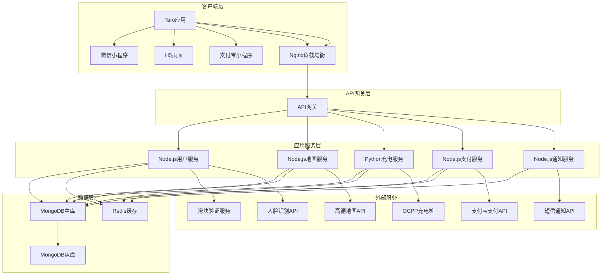
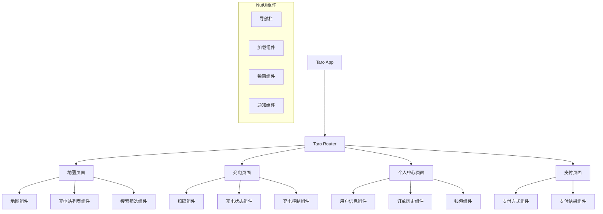

# 设计文档

## 概述

智能充电应用是一个基于 Taro 跨平台框架的移动端应用，为电动汽车用户提供充电站查找、充电管理和支付服务。系统采用微服务架构，支持高并发访问，集成 OCPP 协议与充电桩通信，使用高德地图提供位置服务，通过支付宝沙箱环境处理支付交易，部署在阿里云平台。

### 核心设计原则

- **用户体验优先**: 简化操作流程，3 秒内完成关键操作
- **实时性**: 充电状态、支付结果等关键信息实时更新
- **可扩展性**: 支持未来功能扩展和用户规模增长
- **安全性**: 支付和用户数据安全保护
- **跨平台兼容**: 支持微信小程序、H5、支付宝小程序等多端运行

## 架构

### 系统架构图



### 技术栈选择

**前端技术栈:**

- **Taro**: 跨平台小程序开发框架，支持 React 语法
- **NutUI**: 京东风格的移动端组件库，适配多端
- **TypeScript**: 类型安全的 JavaScript 超集
- **Vite**: 快速构建工具，优化开发体验
- **React Hooks**: 状态管理和组件逻辑复用

**后端技术栈:**

- **Node.js**: 用户管理、地图服务、支付服务、通知服务
- **Python**: 充电服务，处理 OCPP 协议通信
- **Express.js**: Node.js Web 框架
- **FastAPI**: Python 异步 Web 框架，适合高并发场景

**数据存储:**

- **MongoDB**: 主数据库，存储用户、充电站、订单等数据
- **Redis**: 缓存层，存储会话、实时充电状态等
- **阿里云 OSS**: 静态资源存储（充电站图片等）

**云服务:**

- **阿里云**: 云计算平台，提供 ECS、RDS、OSS 等服务

## 组件和接口

### 前端组件架构



### 核心组件设计

#### 1. 地图组件 (MapComponent)

```typescript
interface MapComponentProps {
  center: Location;
  stations: ChargingStation[];
  onStationSelect: (station: ChargingStation) => void;
  onLocationChange: (location: Location) => void;
}

interface ChargingStation {
  id: string;
  name: string;
  location: Location;
  status: "available" | "busy" | "offline";
  availableSlots: number;
  totalSlots: number;
  pricing: PricingInfo;
}
```

#### 2. 充电状态组件 (ChargingStatusComponent)

```typescript
interface ChargingStatusProps {
  sessionId: string;
  status: ChargingStatus;
  onStopCharging: () => void;
}

interface ChargingStatus {
  duration: number; // 秒
  powerLevel: number; // 当前电量百分比
  chargingRate: number; // kW
  cost: number; // 累计费用
  estimatedTime: number; // 预计剩余时间
}
```

#### 3. 滑块验证组件 (SliderVerifyComponent)

```typescript
interface SliderVerifyProps {
  onVerifySuccess: (token: string) => void;
  onVerifyFailed: (error: string) => void;
}

interface SliderVerifyResult {
  success: boolean;
  token: string;
  slideDistance: number;
  timestamp: number;
}
```

#### 4. 人脸验证组件 (FaceVerifyComponent)

```typescript
interface FaceVerifyProps {
  onVerifySuccess: (result: FaceVerifyResult) => void;
  onVerifyFailed: (error: string) => void;
  enableLiveDetection: boolean;
}

interface FaceVerifyResult {
  success: boolean;
  confidence: number; // 置信度
  liveDetectionPassed: boolean;
  verificationToken: string;
}
```

### API 接口设计

#### 1. 用户服务接口

```typescript
// 滑块验证
POST /api/auth/slider-verify
{
  "slideToken": "滑块验证令牌",
  "slideDistance": 120,
  "timestamp": 1641888000000
}

// 人脸验证
POST /api/auth/face-verify
{
  "faceImage": "base64编码的人脸图片",
  "liveDetection": true,
  "userId": "用户ID"
}

// 用户认证（完成验证后）
POST /api/auth/login
{
  "phone": "手机号",
  "verificationToken": "验证通过令牌",
  "userInfo": {
    "nickName": "用户昵称",
    "avatarUrl": "头像URL"
  }
}

// 用户信息更新
PUT /api/users/profile
{
  "nickName": "新昵称",
  "phone": "手机号"
}

// 车辆管理
POST /api/users/vehicles
{
  "brand": "品牌",
  "model": "型号",
  "licensePlate": "车牌号"
}
```

#### 2. 地图服务接口

```typescript
// 获取附近充电站
GET /api/stations/nearby?lat=39.9042&lng=116.4074&radius=5000&type=fast

// 充电站详情
GET /api/stations/:stationId

// 充电桩实时状态
GET /api/stations/:stationId/chargers
```

#### 3. 充电服务接口

```typescript
// 启动充电
POST /api/charging/start
{
  "chargerId": "充电桩ID",
  "qrCode": "二维码内容"
}

// 获取充电状态
GET /api/charging/sessions/:sessionId/status

// 停止充电
POST /api/charging/sessions/:sessionId/stop
```

#### 4. 支付服务接口

```typescript
// 创建支付订单
POST /api/payments/orders
{
  "amount": 50.00,
  "type": "charging",
  "sessionId": "充电会话ID"
}

// 钱包充值
POST /api/wallet/recharge
{
  "amount": 100.00,
  "paymentMethod": "alipay"
}
```

### WebSocket 实时通信

```typescript
// 充电状态实时更新
interface ChargingStatusUpdate {
  sessionId: string;
  status: "charging" | "completed" | "error";
  data: ChargingStatus;
  timestamp: number;
}

// 支付结果通知
interface PaymentNotification {
  orderId: string;
  status: "success" | "failed";
  amount: number;
  timestamp: number;
}
```

## 数据模型

### MongoDB 集合设计

#### 1. 用户集合 (users)

```javascript
{
  _id: ObjectId,
  phone: String, // 手机号作为主要标识
  nickName: String,
  avatarUrl: String,
  balance: Number, // 账户余额
  faceFeatures: String, // 人脸特征数据（加密存储）
  verificationLevel: String, // 验证等级：basic, face_verified
  vehicles: [{
    brand: String,
    model: String,
    licensePlate: String,
    batteryCapacity: Number
  }],
  createdAt: Date,
  updatedAt: Date
}
```

#### 2. 充电站集合 (charging_stations)

```javascript
{
  _id: ObjectId,
  name: String,
  address: String,
  location: {
    type: "Point",
    coordinates: [Number, Number] // [经度, 纬度]
  },
  operator: String, // 运营商
  operatingHours: {
    open: String, // "00:00"
    close: String  // "24:00"
  },
  parkingFee: Number,
  photos: [String], // 图片URL数组
  chargers: [{
    chargerId: String,
    type: String, // "fast" | "slow"
    power: Number, // kW
    status: String, // "available" | "busy" | "offline"
    pricing: {
      electricityFee: Number, // 电费
      serviceFee: Number      // 服务费
    }
  }],
  rating: Number,
  reviewCount: Number,
  createdAt: Date,
  updatedAt: Date
}
```

#### 3. 充电会话集合 (charging_sessions)

```javascript
{
  _id: ObjectId,
  sessionId: String, // 唯一会话ID
  userId: ObjectId,
  stationId: ObjectId,
  chargerId: String,
  status: String, // "active" | "completed" | "cancelled" | "error"
  startTime: Date,
  endTime: Date,
  duration: Number, // 秒
  energyDelivered: Number, // kWh
  startPowerLevel: Number, // 开始时电量百分比
  endPowerLevel: Number,   // 结束时电量百分比
  totalCost: Number,
  paymentStatus: String, // "pending" | "paid" | "failed"
  createdAt: Date,
  updatedAt: Date
}
```

#### 4. 订单集合 (orders)

```javascript
{
  _id: ObjectId,
  orderId: String,
  userId: ObjectId,
  type: String, // "charging" | "recharge"
  amount: Number,
  status: String, // "pending" | "paid" | "cancelled" | "refunded"
  paymentMethod: String, // "balance" | "alipay"
  sessionId: ObjectId, // 关联充电会话
  thirdPartyOrderId: String, // 第三方支付订单号
  createdAt: Date,
  updatedAt: Date
}
```

### Redis 缓存策略

```javascript
// 充电站实时状态缓存
"station:{stationId}:chargers" -> JSON // TTL: 30秒

// 用户会话缓存
"user:{userId}:session" -> JSON // TTL: 7天

// 充电会话实时状态
"charging:{sessionId}:status" -> JSON // TTL: 24小时

// 地图区域充电站缓存
"map:stations:{lat}:{lng}:{radius}" -> JSON // TTL: 5分钟

// 用户余额缓存
"user:{userId}:balance" -> Number // TTL: 1小时
```

## 错误处理

### 错误分类和处理策略

#### 1. 客户端错误处理

```typescript
enum ErrorType {
  NETWORK_ERROR = "NETWORK_ERROR",
  PERMISSION_DENIED = "PERMISSION_DENIED",
  QR_CODE_INVALID = "QR_CODE_INVALID",
  INSUFFICIENT_BALANCE = "INSUFFICIENT_BALANCE",
  CHARGING_FAILED = "CHARGING_FAILED",
}

interface ErrorHandler {
  showError(type: ErrorType, message: string): void;
  retryOperation(
    operation: () => Promise<any>,
    maxRetries: number
  ): Promise<any>;
  reportError(error: Error, context: string): void;
}
```

#### 2. 服务端错误处理

```javascript
// 统一错误响应格式
{
  "success": false,
  "errorCode": "STATION_NOT_FOUND",
  "message": "充电站不存在",
  "timestamp": "2025-01-12T10:30:00Z",
  "requestId": "req_123456789"
}

// 错误码定义
const ERROR_CODES = {
  // 用户相关
  USER_NOT_FOUND: 'USER_NOT_FOUND',
  INVALID_TOKEN: 'INVALID_TOKEN',

  // 充电相关
  CHARGER_UNAVAILABLE: 'CHARGER_UNAVAILABLE',
  CHARGING_SESSION_NOT_FOUND: 'CHARGING_SESSION_NOT_FOUND',

  // 支付相关
  INSUFFICIENT_BALANCE: 'INSUFFICIENT_BALANCE',
  PAYMENT_FAILED: 'PAYMENT_FAILED'
};
```

#### 3. OCPP 协议错误处理

```python
# OCPP错误处理
class OCPPErrorHandler:
    def handle_charger_fault(self, charger_id: str, error_code: str):
        # 记录错误日志
        # 更新充电桩状态
        # 通知用户
        pass

    def handle_communication_timeout(self, charger_id: str):
        # 标记充电桩离线
        # 停止相关充电会话
        pass
```

### 容错机制

#### 1. 服务降级

- 地图服务不可用时，显示缓存的充电站列表
- 支付服务异常时，允许余额支付
- 实时状态更新失败时，显示最后已知状态

#### 2. 重试机制

- 网络请求失败：指数退避重试，最多 3 次
- 支付请求：立即重试 1 次，失败后引导用户手动重试
- OCPP 通信：每 30 秒重试，最多重试 10 次

#### 3. 熔断器模式

```javascript
class CircuitBreaker {
  constructor(threshold = 5, timeout = 60000) {
    this.failureThreshold = threshold;
    this.timeout = timeout;
    this.failureCount = 0;
    this.state = "CLOSED"; // CLOSED, OPEN, HALF_OPEN
  }

  async call(operation) {
    if (this.state === "OPEN") {
      throw new Error("Circuit breaker is OPEN");
    }

    try {
      const result = await operation();
      this.onSuccess();
      return result;
    } catch (error) {
      this.onFailure();
      throw error;
    }
  }
}
```

## 测试策略

### 测试金字塔

#### 1. 单元测试 (70%)

```javascript
// 前端组件测试
describe("ChargingStatusComponent", () => {
  it("should display charging information correctly", () => {
    const mockStatus = {
      duration: 1800,
      powerLevel: 65,
      chargingRate: 50,
      cost: 25.5,
    };

    const wrapper = render(<ChargingStatusComponent status={mockStatus} />);
    expect(wrapper.getByText("30分钟")).toBeInTheDocument();
    expect(wrapper.getByText("65%")).toBeInTheDocument();
  });
});

// 后端服务测试
describe("ChargingService", () => {
  it("should start charging session successfully", async () => {
    const result = await chargingService.startCharging(
      "charger_123",
      "user_456"
    );
    expect(result.sessionId).toBeDefined();
    expect(result.status).toBe("active");
  });
});
```

#### 2. 集成测试 (20%)

```javascript
// API集成测试
describe("Charging API Integration", () => {
  it("should complete full charging flow", async () => {
    // 1. 启动充电
    const startResponse = await request(app)
      .post("/api/charging/start")
      .send({ chargerId: "test_charger", qrCode: "test_qr" });

    // 2. 检查状态
    const statusResponse = await request(app).get(
      `/api/charging/sessions/${startResponse.body.sessionId}/status`
    );

    // 3. 停止充电
    const stopResponse = await request(app).post(
      `/api/charging/sessions/${startResponse.body.sessionId}/stop`
    );

    expect(stopResponse.status).toBe(200);
  });
});
```

#### 3. 端到端测试 (10%)

```javascript
// E2E测试场景
describe("Complete User Journey", () => {
  it("should allow user to find station, charge, and pay", async () => {
    // 1. 用户登录
    await page.goto("/pages/login/index");
    await page.fill('[data-testid="phone-input"]', "13800138000");
    
    // 2. 滑块验证
    await page.waitForSelector('[data-testid="slider-verify"]');
    await page.dragAndDrop('[data-testid="slider-handle"]', '[data-testid="slider-target"]');
    
    // 3. 人脸验证
    await page.click('[data-testid="face-verify-btn"]');
    await page.waitForSelector('[data-testid="camera-preview"]');
    await page.click('[data-testid="capture-face"]');
    
    // 4. 完成登录
    await page.click('[data-testid="login-submit"]');

    // 2. 查找充电站
    await page.goto("/pages/map/index");
    await page.waitForSelector('[data-testid="station-marker"]');
    await page.click('[data-testid="station-marker"]');

    // 3. 开始充电
    await page.click('[data-testid="start-charging"]');
    await page.click('[data-testid="scan-qr"]');

    // 4. 支付
    await page.waitForSelector('[data-testid="payment-modal"]');
    await page.click('[data-testid="pay-with-alipay"]');

    // 验证结果
    await expect(page.locator('[data-testid="charging-active"]')).toBeVisible();
  });
});
```

### 性能测试

#### 1. 负载测试

- 并发用户数：1000 用户同时使用
- 响应时间：API 响应时间 < 500ms
- 吞吐量：支持每秒 100 次充电启动请求

#### 2. 压力测试

- 峰值负载：5000 并发用户
- 系统稳定性：持续运行 24 小时无崩溃
- 资源使用：CPU 使用率 < 80%，内存使用率 < 70%

#### 3. 安全测试

- SQL 注入防护测试
- XSS 攻击防护测试
- 支付接口安全测试
- 用户数据加密验证
